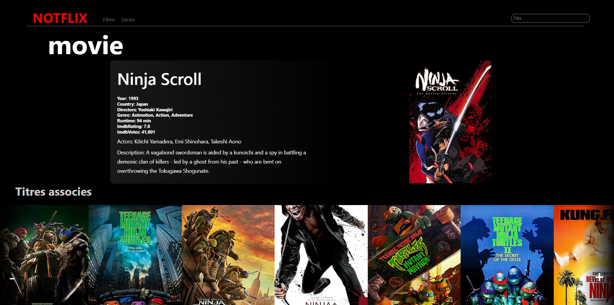

# Notflix - A Movie Recommendation App

This small project was a school assignment designed to interact with an API. It provided my first experience in consuming APIs in a React application. I learned how to handle API data and integrate it into a web application. I also gained insights into HTML and CSS for frontend development and react components and hooks.

## What I Learned

- Practical experience in consuming APIs using React.
- Gained insights into handling API data and integrating it into web applications.
- Enhanced understanding of HTML and CSS for frontend development.
- Basic knowledge of React components and hooks.

## Technologies Used

- React
- HTML
- CSS
- RESTful API

## Screenshot

